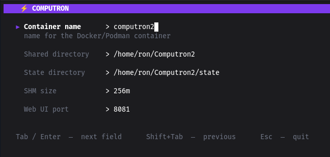

# omnideck

[](https://go.dev)
[](LICENSE)
[](#install)

CLI for setting up, managing, and monitoring [Omnideck](https://github.com/omnideck-dev/omnideck) — a containerized AI assistant. Wraps Docker or Podman with a Bubble Tea TUI and guided setup.

---


<!-- Replace with an actual recording once available. Suggested tool: vhs (https://github.com/charmbracelet/vhs) -->

---

## Features

- **Guided setup** — diagnoses, installs, starts, or repairs Podman or Docker before configuring Omnideck
- **Smart memory defaults** — suggests container RAM limits based on your system (20% of host RAM, 1–8 GB)
- **Update in place** — pulls the latest image and recreates the container, preserving config
- **Multi-instance** — run more than one Omnideck container on different ports from a single binary
- **Actionable health check** — `doctor` identifies the root problem, explains what it affects, and can open the same guided fix used by Setup
- **Docker + Podman** — auto-detected; SELinux, volume ownership, and Ollama host differences handled per OS
- **Backup on uninstall** — optionally archives data directories to a `.tar.gz` before removal
- **`--no-color`** — safe to pipe; exits non-zero on actual failures, not on warnings

---

## Requirements

| Engine | Version policy | Notes |
|--------|----------------|-------|
| Docker | 20.10+ on Linux | Older Linux versions cannot provide Omnideck's connection to apps installed directly on the same computer |
| Podman | Must pass the built-in readiness check | Version 4 is not required. A version number alone cannot prove whether this computer's network lets Omnideck reach a local Ollama installation. |

Ollama is optional at install time — the wizard warns if it isn't reachable but proceeds anyway.

### Why does Omnideck run in a container?

Omnideck runs inside a container. The container keeps the agent and its software
isolated from the rest of your system. It also lets Omnideck start, stop, and
update all of its parts together without installing those parts directly on
your computer. Podman or Docker runs the container. You only need one of them.

The installer uses Podman or Docker when either is already working. Otherwise it
recommends the easiest default for the platform:

| Platform | Fresh-install recommendation | Why |
|---|---|---|
| Linux | Podman | Free, lightweight, and designed to run without giving a background app full control of the computer |
| macOS with an Apple chip (M1 or newer) | Podman's official installer | Free, with an installer provided by the Podman project |
| macOS with an Intel chip | Docker Desktop | Docker still provides a current Intel Mac installer; Podman's newest Mac installer is Apple-chip only |
| Windows 10/11 | Docker Desktop | The most guided Windows setup; Podman's official Windows installer remains a visible free alternative |
| Linux running inside Windows (WSL) | Docker Desktop | Reuses Docker managed by Windows instead of installing a second copy inside Linux |

The interactive wizard can ask your computer's built-in tools to install or
start Podman or Docker, then check the result automatically. Before it does
anything, it shows a numbered explanation and waits for a second confirmation.
Technical commands stay hidden unless the user asks to see them. It never runs
a downloaded setup script or silently changes account security settings. App
installers open from their official pages, and the wizard waits for you to
return and press Enter before it checks again.

Run `omnideck` as your normal user. Do not put `sudo` before it or choose
**Run as administrator**. Omnideck never sees or stores a password.

| Computer | What permission may be requested? |
|---|---|
| Linux | The computer's app installer may ask for the user's account password while it installs Podman or starts Docker. The account must be allowed to install software. |
| macOS | Omnideck runs normally. The official Podman or Docker installer may ask for the user's Mac password while it adds Podman or Docker. |
| Windows with Docker Desktop | Keep the installer's recommended **Per-user** choice. That normally needs no special permission. Windows may need approval from the person who manages the computer the first time it turns on the built-in Linux feature Docker uses. |
| Windows with Podman | The recommended **Just for me** install needs no administrator. Podman requires Windows 11 and either WSL 2 or Hyper-V; enabling one of those Windows features requires an administrator and may require a restart. |

---

## Install

### Homebrew (macOS / Linux)

```sh
# tap not yet published — build from source in the meantime
```

### Build from source

Requires Go 1.25+. A missing Docker/Podman installation can be handled by the
interactive wizard after the CLI is built. In the example below, the computer
asks for a password only while copying the finished CLI into a shared apps
folder. Run `omnideck` itself as the normal user.

```sh
git clone https://github.com/omnideck-dev/cli
cd omnideck-cli
go build -ldflags="-s -w" -o omnideck .
sudo mv omnideck /usr/local/bin/
```

### Verify

```sh
omnideck --version
```

---

## Quickstart

```sh
# 1. Start Omnideck. First use opens guided setup automatically.
omnideck

# 2. Check everything is healthy
omnideck doctor

# 3. Open the web UI
#    http://localhost:2337
```

The wizard diagnoses or sets up Podman or Docker, checks Ollama reachability,
suggests memory limits sized for your machine, and starts the container. With
`--plain`, a ready runtime performs the same container setup without the TUI. If
the runtime is missing, it prints the recommended commands or official URL and
exits without installing host software.

See the [screen-by-screen macOS walkthrough](docs/mac-setup-walkthrough.md) for
the exact fresh-install flow and user-facing text. The
[setup flow matrix](docs/setup-flow-matrix.md) records the first-run,
returning, repair, and additional-instance transitions shared across platforms.

---

## Usage

```
omnideck <command> [flags]
```

### Commands

| Command | Description |
|---|---|
| `setup` | Set up one additional Omnideck instance (`install` remains an alias) |
| `update` | Pull the latest image and recreate the container |
| `start` | Start a stopped container |
| `stop` | Gracefully stop the running container |
| `restart` | Stop then start |
| `status` | Print a status table (container, dirs, Ollama, web UI port) |
| `logs` | Tail container logs |
| `doctor` | Check runtime, instance, browser, storage, memory, and optional local AI; offer safe next steps |
| `config show` | Pretty-print the saved config |
| `config set <key> <value>` | Update a single config key |
| `config path` | Print the config file path |
| `uninstall` | Stop, remove container, optionally delete data dirs |

### Global flags

```
--config string   Use a specific config file instead of the saved instance picker
--name string     Instance name (e.g. omnideck, omnideck2)
--no-color        Disable color output
--debug           Print raw engine commands and stderr
--version         Print version and exit
```

### Setup flags

```
--engine string   Initial container runtime: docker or podman (all instances use the same runtime)
--image string    Override the container image (for testing alternate builds)
```

`--engine` can select the runtime during the first setup. Interactive first setup keeps both choices visible even when Docker or Podman is already installed. After an instance exists, Omnideck uses its saved shared runtime for every instance and will not silently switch existing installations or disconnect their saved container data.

### Examples

```sh
# Tail logs and follow
omnideck logs --follow --tail 100

# Manage a specific instance by name
omnideck --name omnideck2 status
omnideck --name omnideck2 stop

# Choose Docker during the first setup
omnideck setup --engine docker

# Test an alternate image without changing the default
omnideck setup --image ghcr.io/example/omnideck:dev

# Non-interactive setup for CI/CD
omnideck setup --plain --engine docker --port 2337

# Uninstall a specific instance
omnideck --name omnideck2 uninstall
```

### Multiple instances

Choose **Setup** from the dashboard, or run `omnideck setup`, to create exactly one additional instance. Each setup suggests a unique container name (`omnideck2`, `omnideck3`, …), separate named volumes, and the next available browser port. Names and ports are checked before Omnideck changes anything; unrelated containers are never replaced.

Commands that need an instance (e.g. `start`, `status`) show a picker when more than one instance exists, or accept `--name` to skip the prompt.

---

## Configuration

Config files use the conventional per-user location for each operating system:

| Operating system | Config directory |
|---|---|
| Linux | `$XDG_CONFIG_HOME/omnideck-cli`, or `~/.config/omnideck-cli` |
| macOS | `~/Library/Application Support/omnideck-cli` |
| Windows | `%AppData%\omnideck-cli` |

Each installation is stored under `instances/<container-name>.yaml` in that directory.
Existing alpha configuration under `~/.config/omnideck-cli` is copied automatically when needed; existing files in the conventional location are never overwritten.

```yaml
container_name: omnideck
home_volume: omnideck-home
state_volume: omnideck-state
memory: 3g
shm_size: 1536m
web_ui_port: "2337"
image: ghcr.io/omnideck-dev/omnideck:main
installed_at: 2025-01-15T10:30:00Z
```

The runtime shared by every instance is stored separately:

```yaml
# <config directory>/settings.yaml
runtime: docker
```

**`home_volume`** is mounted into the container at `/home/omnideck`. Empty or missing means `{container_name}-home`.
**`state_volume`** is mounted into the container at `/var/lib/omnideck`. Empty or missing means `{container_name}-state`.
**`memory`** and **`shm_size`** are set during setup based on your system RAM and can be adjusted later.

---

## Contributing

1. Fork and clone the repo
2. `go test ./...` — all tests must pass
3. `go vet ./...` — no vet errors
4. Open a PR against `main`

**Engine calls shell out intentionally** — no Docker SDK. Keep the binary dependency-free when adding engine features.

**Platform rules:** never add a Linux-only flag without a `runtime.GOOS` guard. Key differences between Linux and macOS:

| Concern | Linux | macOS |
|---------|-------|-------|
| Volumes | Named volumes | Named volumes |
| Ollama env | CLI sets runtime-specific `OLLAMA_HOST` | CLI sets runtime-specific `OLLAMA_HOST` |

See `CLAUDE.md` for the full platform table and architecture notes.

Preview releases follow `alpha → beta → rc → stable` Semantic Versioning. See
[RELEASING.md](RELEASING.md) for the tagging, promotion, and GitHub prerelease
workflow.

---

## License

MIT © [rlnorthcutt](https://github.com/rlnorthcutt)
