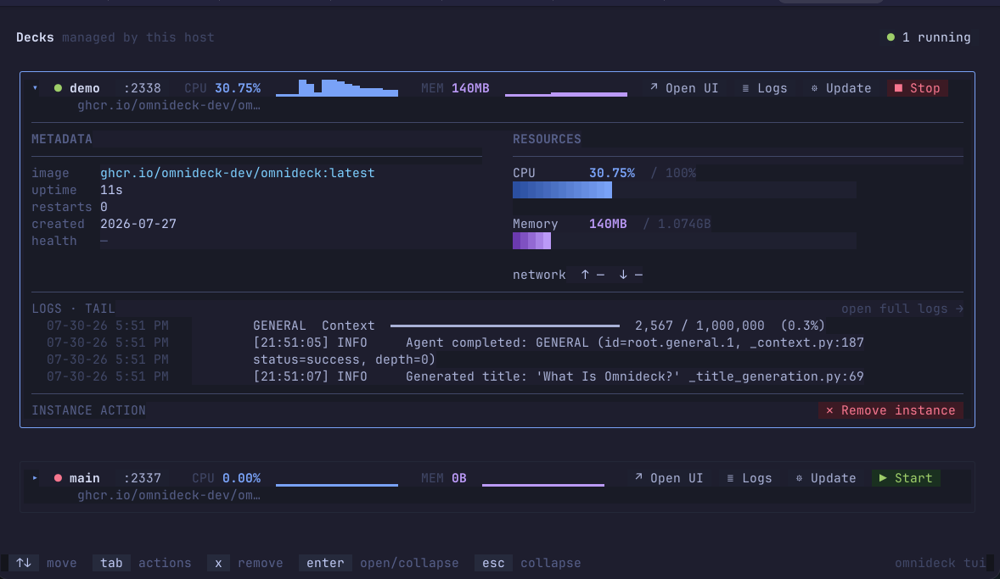

# omnideck

[](https://go.dev)
[](LICENSE)
[](#install)

CLI for setting up, managing, and monitoring [Omnideck](https://github.com/omnideck-dev/omnideck) — a containerized AI assistant. It uses Podman through a Bubble Tea TUI and the same guided setup backend as the desktop app.

---


<!-- Replace with an actual recording once available. Suggested tool: vhs (https://github.com/charmbracelet/vhs) -->

---

## Features

- **Guided setup** — bare `omnideck` detects, installs, starts, or repairs Podman before configuring Omnideck
- **Smart memory defaults** — Desktop and CLI use the same host-sized 1–6 GB container policy, with macOS capped below its VM limit
- **Safe maintenance** — update and repair share one review-first recreate flow with rollback and preserved data volumes
- **Multi-instance** — run more than one Omnideck container on different ports from a single binary
- **Actionable health check** — `doctor` identifies the root problem and can open runtime setup, start a stopped instance, or repair a missing container
- **One shared runtime** — Desktop and CLI use the same `omnideck-runtime` Podman machine on Windows and macOS; Linux uses native Podman
- **Safe instance removal** — keeps saved data by default, with an optional backup before permanent deletion
- **`--no-color`** — safe to pipe; exits non-zero on actual failures, not on warnings

---

## Requirements

| Container runtime | Version policy | Notes |
|--------|----------------|-------|
| Podman | Must pass the built-in readiness check | Omnideck verifies the engine and its named machine instead of trusting a version number alone. |

Ollama is optional during setup. Omnideck reports when it is not reachable but
continues without it.

### Why does Omnideck run in a container?

Omnideck runs inside a container. The container keeps the agent and its software
isolated from the rest of your system. It also lets Omnideck start, stop, and
update all of its parts together without installing those parts directly on
your computer. Podman runs that container.

There is no runtime choice to make. On a fresh computer, running `omnideck`
with no arguments opens the Welcome screen and then performs the same setup
workflow used by Desktop:

| Platform | Automatic setup |
|---|---|
| Linux | Uses the recognized distribution package family and a native permission prompt to install Podman, then verifies it |
| macOS with an Apple chip (M1 or newer) | Downloads, verifies, and installs the pinned official Podman package, then prepares `omnideck-runtime` |
| macOS with an Intel chip | Downloads, verifies, and installs Podman's latest official Intel package, then prepares `omnideck-runtime` |
| Windows 10/11 | Enables WSL 2 when needed, resumes after a required restart, installs the pinned official Podman MSI, and prepares `omnideck-runtime` |

The Welcome screen is the confirmation. After the user presses Enter, setup
continues automatically and shows the same four phases as Desktop: computer
setup, secure space (Windows/macOS), application files, and final checks.
Downloaded installers are pinned, checksum-verified, and cached for retry.
Technical commands and raw download URLs are not part of the normal flow.

Run `omnideck` as your normal user. Do not put `sudo` before it or choose
**Run as administrator**. Omnideck never sees or stores a password.

| Computer | What permission may be requested? |
|---|---|
| Linux | The package manager may ask for permission while it installs Podman. The account must be allowed to install software. |
| macOS | macOS may ask for the user's password while it installs Podman. |
| Windows | Windows may request administrator approval while it enables WSL 2. A restart can be required; choosing **Restart now** makes the CLI reopen after sign-in and continue automatically. The Podman install itself uses the per-user MSI mode. |

When Ollama is running, setup checks it twice: first on the computer, then from
inside the running Omnideck container. This prevents a Windows-local check from
being reported as proof that Podman can connect. If the real Windows/Podman
check fails, setup shows the exact Ollama environment-variable and restart
steps; local AI remains optional and online AI continues to work.

---

## Install

### Homebrew (macOS / Linux)

```sh
# tap not yet published — build from source in the meantime
```

### Build from source

Requires Go 1.25.12+. A missing Podman installation can be handled by the
guided setup after the CLI is built. In the example below, the computer
asks for a password only while copying the finished CLI into a shared apps
folder. Run `omnideck` itself as the normal user.

```sh
git clone https://github.com/omnideck-dev/cli
cd omnideck-cli
go build -trimpath -o omnideck .
sudo mv omnideck /usr/local/bin/
```

### Verify

```sh
omnideck --version
```

### Verify a downloaded release

Every release includes `SHA256SUMS` and one SPDX software bill of materials
for each platform archive. Download `SHA256SUMS` beside the archive, then check
that its recorded SHA-256 value matches the file you received.

On Windows, PowerShell can print the archive's value:

```powershell
Get-FileHash .\omnideck-windows-amd64.zip -Algorithm SHA256
```

GitHub also records signed build provenance for both the archive and the
executable inside it. If GitHub CLI is installed, extract the archive and run:

```powershell
gh attestation verify .\omnideck.exe --repo omnideck-dev/cli
```

The checksum catches a changed download. The attestation proves which
repository, commit, and GitHub Actions workflow built it; neither check alone
proves that software is harmless. Preview Windows builds do not yet have a
Microsoft Authenticode publisher signature. Do not bypass a malware warning.
See [release security and Windows detections](docs/release-security.md).

---

## Quickstart

```sh
# 1. Start Omnideck. First use opens guided setup automatically.
omnideck

# 2. Check everything is healthy
omnideck doctor

# 3. Open the web UI
#    http://localhost:2337
```

Guided setup diagnoses or sets up Podman, checks Ollama reachability,
suggests memory limits sized for your machine, and starts the container. With
`--plain`, a ready runtime performs the same container setup without the TUI. If
the runtime is missing, it prints the recommended commands or official URL and
exits without installing host software.

The [setup flow matrix](docs/setup-flow-matrix.md) records the first-run,
returning, repair, and additional-instance transitions shared across platforms.

---

## Usage

```
omnideck <command> [flags]
```

### Commands

| Command | Description |
|---|---|
| `add` | Set up the first or one additional Omnideck instance (`install` and `setup` remain aliases) |
| `list` | List saved installations, their container status, and browser addresses (`instances` is an alias) |
| `update` | Download and apply the latest Omnideck version (`--plain` for non-interactive) |
| `start` | Start a stopped container |
| `stop` | Gracefully stop the running container |
| `restart` | Stop then start |
| `status` | Print a status table (installation, saved volumes, optional local AI, browser address) |
| `logs` | Tail container logs |
| `doctor` | Check runtime, instance, browser, storage, memory, and optional local AI; offer safe next steps |
| `config show` | Pretty-print the saved config |
| `config set <key> <value>` | Save one setting and explain how to apply it |
| `config path` | Print the config file path |
| `environment ensure` | Reconcile an exact desired instance for Desktop or automation (`--json`) |
| `remove NAME` | Remove one instance; keep its data by default or explicitly back up and delete it (`uninstall` remains an alias; `--plain` for non-interactive) |

### Global flags

```
--config string   Use a specific config file instead of the saved instance picker
--name string     Instance name (e.g. omnideck, omnideck2)
--no-color        Disable color output
--debug           Print raw container runtime commands and stderr
--version         Print version and exit
```

### Setup flags

```
--runtime string  Container runtime compatibility flag (Omnideck uses Podman)
--image string    Override the container image (for testing alternate builds)
```

Omnideck uses Podman on every platform. The compatibility `--runtime` flag
accepts only `podman`; runtime selection is not presented to users.

### Examples

```sh
# Tail logs and follow
omnideck logs --follow --tail 100

# Manage a specific instance by name
omnideck --name omnideck2 status
omnideck --name omnideck2 stop

# Test an alternate image without changing the default
omnideck add --image ghcr.io/example/omnideck:dev

# Non-interactive setup for CI/CD
omnideck add --plain --port 2337

# Remove a specific instance
omnideck remove omnideck2
```

### Multiple instances

Choose **Setup** from the dashboard, or run `omnideck add`, to create exactly one additional instance. Each setup suggests a unique container name (`omnideck2`, `omnideck3`, …), separate named volumes, and the next available browser port. Names and ports are checked before Omnideck changes anything; unrelated containers are never replaced.

Commands that need an instance (e.g. `start`, `status`) show a picker when more than one instance exists, or accept `--name` to skip the prompt.
Scripts and other non-interactive uses must pass `--name` when more than one
instance exists; the CLI never tries to open an interactive picker without a terminal.

Running bare `omnideck` routes to the right journey: first setup when nothing is
configured, guided runtime setup when Podman is unavailable, Doctor when
a saved container is missing, and the dashboard when the installation is healthy
or deliberately stopped.

See [docs/architecture.md](docs/architecture.md) for the workflow and package map.

---

## Configuration

Config files use the conventional per-user location for each operating system:

| Operating system | Config directory |
|---|---|
| Linux | `$XDG_CONFIG_HOME/omnideck-cli`, or `~/.config/omnideck-cli` |
| macOS | `~/Library/Application Support/omnideck-cli` |
| Windows | `%AppData%\omnideck-cli` |

Each installation is stored under `instances/<container-name>.yaml` in that directory.
Existing alpha configuration under `~/.config/omnideck-cli` is copied automatically when needed; existing files in the conventional location are never overwritten.

```yaml
container_name: omnideck
home_volume: omnideck-home
state_volume: omnideck-state
memory: 3g
shm_size: 1536m
web_ui_port: "2337"
image: ghcr.io/omnideck-dev/omnideck:latest
installed_at: 2025-01-15T10:30:00Z
```

The runtime shared by every instance is stored separately:

```yaml
# <config directory>/settings.yaml
runtime: podman
```

**`home_volume`** is mounted into the container at `/home/omnideck`. Empty or missing means `{container_name}-home`.
**`state_volume`** is mounted into the container at `/var/lib/omnideck`. Empty or missing means `{container_name}-state`.
**`memory`** and **`shm_size`** are set during setup based on your system RAM and can be adjusted later.

---

## Contributing

1. Fork and clone the repo
2. Run `make verify` — formatting, module metadata, static analysis, tests, workflow validation, and the Go vulnerability scan must pass
3. Open a PR against `main`

**Container runtime calls shell out intentionally** — no Podman SDK. Keep the binary dependency-free when adding runtime features. The internal `engine` package owns these operations.

**Platform rules:** never add a Linux-only flag without a `runtime.GOOS` guard. Key differences between Linux and macOS:

| Concern | Linux | macOS |
|---------|-------|-------|
| Volumes | Named volumes | Named volumes |
| Ollama env | CLI sets runtime-specific `OLLAMA_HOST` | CLI sets runtime-specific `OLLAMA_HOST` |

See `CLAUDE.md` for the full platform table and architecture notes.

Preview releases follow `alpha → beta → rc → stable` Semantic Versioning. See
[RELEASING.md](RELEASING.md) for the tagging, promotion, and GitHub prerelease
workflow.

Report suspected vulnerabilities privately using the instructions in
[SECURITY.md](SECURITY.md), not a public issue.

---

## License

MIT © [rlnorthcutt](https://github.com/rlnorthcutt)
