# macOS setup walkthrough

These previews show the fresh-install path on a Mac with an Apple chip (M1,
M2, M3, M4, or newer). They use the exact user-facing text in the CLI. The
screenshots are rendered previews because they were not captured on macOS.
Buttons and password messages shown by macOS itself can vary by macOS version.

Omnideck detects the Mac's chip automatically. On an older Intel Mac, it
recommends Docker Desktop because Docker still provides a current Intel Mac
installer. On an Apple-chip Mac, it recommends Podman.

## 1. Start the guided setup

Open Terminal and run this as the normal Mac user:

```sh
omnideck
```

Do not put `sudo` before the command. Omnideck does not need to run as the Mac
administrator.

## 2. Choose Podman

The quick computer check runs automatically. If neither Podman nor Docker is
installed, this is the first choice screen:

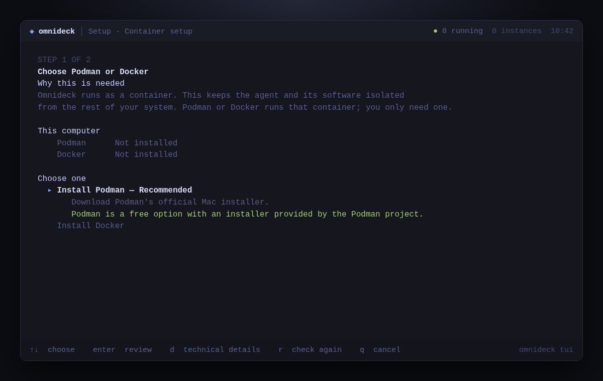

Podman is already selected. Press **Enter** to review it. Pressing the up and
down arrow keys selects a different option. Nothing has been installed yet.

## 3. Review the download

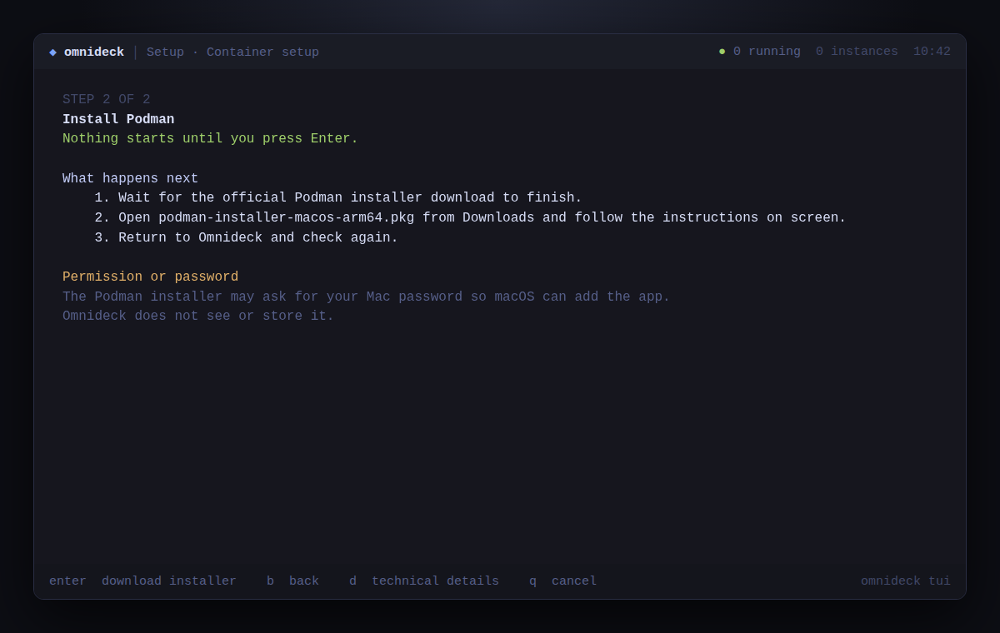

Press **Enter** to start the download from Podman's official GitHub release.
This does not install anything silently.

## 4. Finish the standard Mac installer

Omnideck remains on this screen while the download and installer are open:

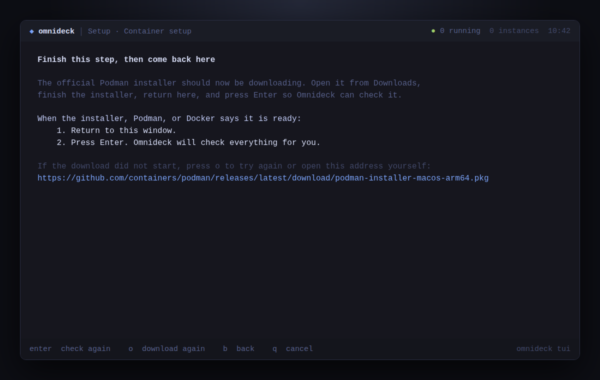

The user's actions outside Omnideck are:

1. Open **Downloads** in Finder.
2. Double-click **podman-installer-macos-arm64.pkg**.
3. In the standard macOS Installer, select **Continue**, then **Install**.
4. If macOS asks for the Mac password or Touch ID, approve it. This gives the
   built-in macOS Installer permission to add Podman. Omnideck cannot see or
   store the password.
5. When the installer says it completed successfully, select **Close**.
6. Return to the Terminal window and press **Enter**.

If the download did not start, press **o** to try it again.

## 5. Let Omnideck finish Podman's one-time setup

The Mac installer adds Podman, but Podman still needs a private Linux workspace
because containers use Linux features that macOS does not include. Omnideck
detects this automatically:

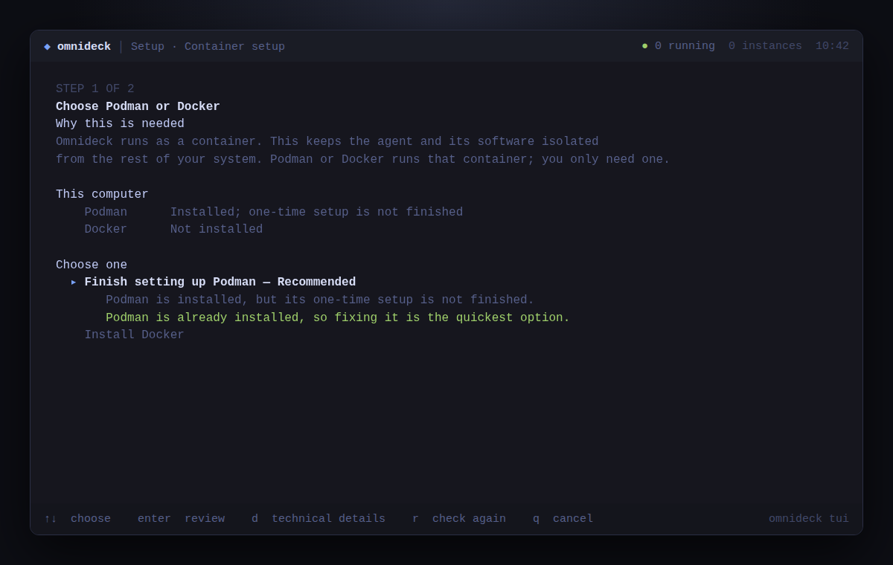

Press **Enter** to review the one-time setup:

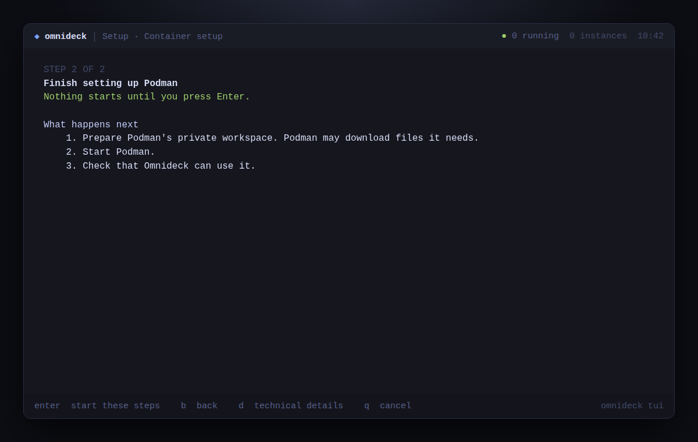

Press **Enter** again. Omnideck runs this command for the user:

```sh
podman machine init --now --update-connection=true
```

The command may download Podman's private Linux workspace and can take a few
minutes. It runs as the normal Mac user. It should not ask for the Mac password,
and Omnideck makes the safe default-connection choice so the user does not have
to answer a technical question. Omnideck then checks Podman automatically.

## 6. Accept the recommended Omnideck settings

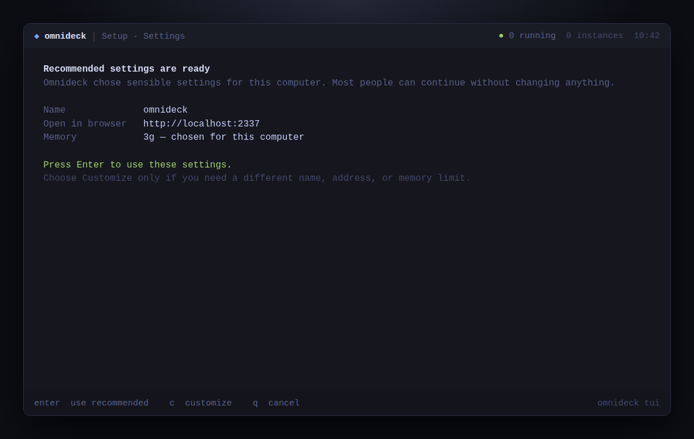

Press **Enter**. The memory shown is calculated from the Mac; `3g` in the
preview is the value shown on a typical 16 GB Mac and may differ on another
computer. Press **c** only when custom settings are needed.

## 7. Give final approval

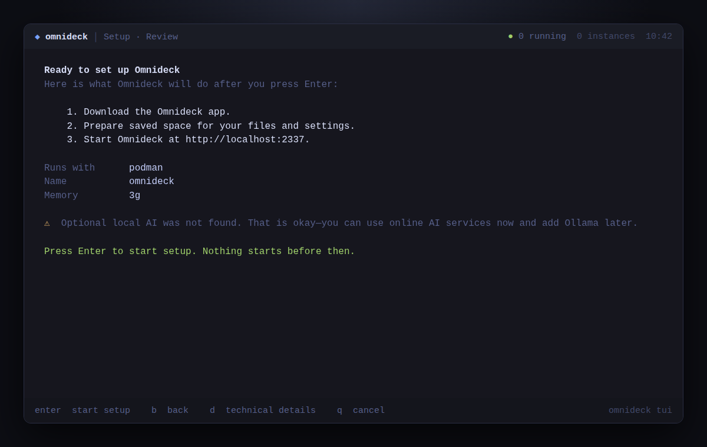

Press **Enter** to start setup. This is the last confirmation. Ollama is
optional, so the warning in the preview does not block setup.

## 8. Wait while Omnideck is downloaded and started

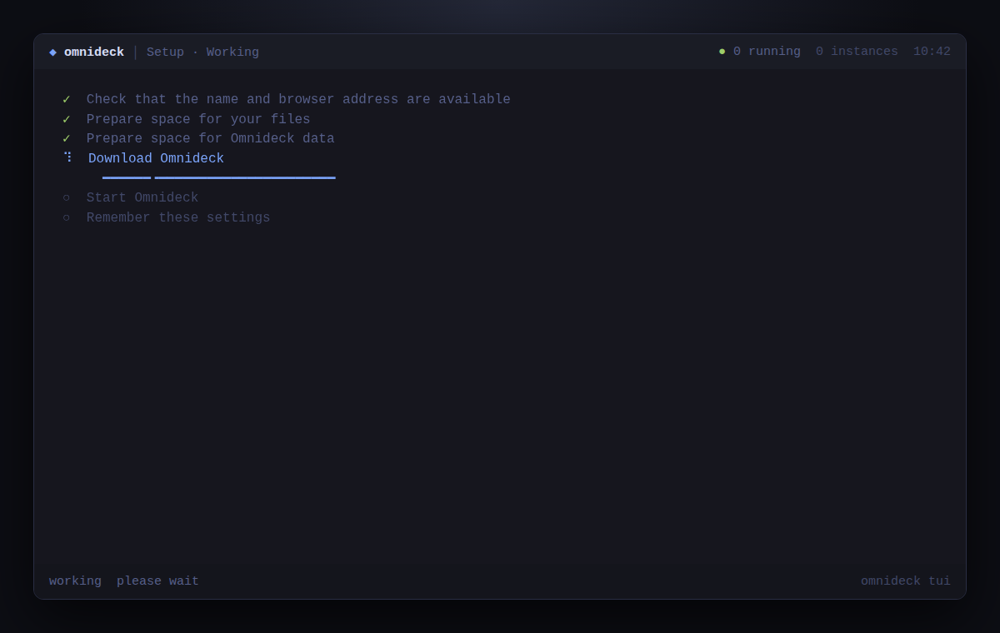

No input is needed on this screen. The first download can take a few minutes.

## 9. Open Omnideck

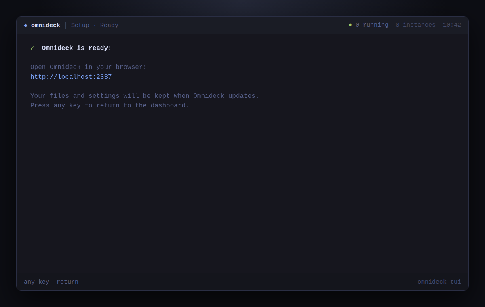

Open `http://localhost:2337` in a browser. Press any key to return to the
Omnideck dashboard.

## What changes on the Mac

- The Omnideck CLI always runs as the normal user.
- Only the standard Podman package installer may ask for the Mac password or
  Touch ID.
- Podman's one-time workspace and Omnideck's saved container data are stored
  for that user.
- The agent runs inside the Omnideck container, keeping its software isolated
  from the rest of the Mac.

## Older Intel Mac path

Omnideck detects an Intel Mac and selects Docker instead:

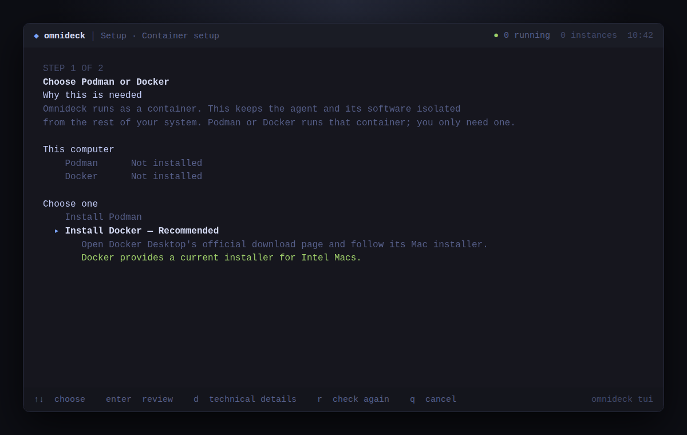

Press **Enter** to see the complete review:

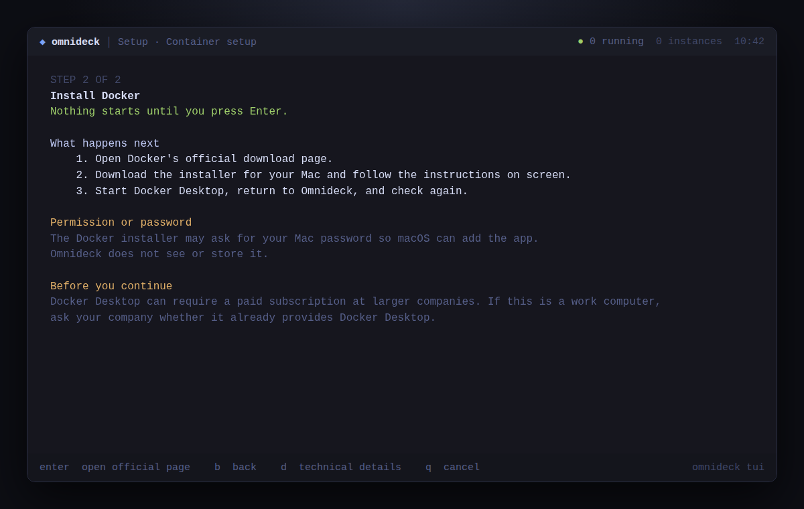

After the next **Enter**, Omnideck opens Docker's official Mac installation
page. Select **Docker Desktop for Mac with Intel chip**, then follow Docker's
current standard steps:

1. Open **Docker.dmg**.
2. Drag Docker to the **Applications** folder.
3. Open **Docker.app** from Applications.
4. Select **Accept** for Docker's subscription agreement.
5. Select **Use recommended settings**. Docker says this choice requires the
   Mac password because it adds the settings Docker needs.
6. Select **Finish**, approve the Mac password request, and wait until Docker
   says it is running.
7. Return to Omnideck and press **Enter**. Omnideck checks Docker and continues
   at the same recommended-settings screen shown in step 6 above.

Docker Desktop is free for personal use, education, non-commercial open source,
and qualifying small businesses. Its official terms require a paid subscription
for larger companies and government entities, so the CLI tells people on work
computers to check with their company first.
